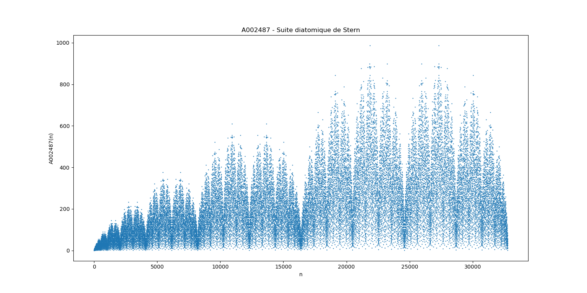
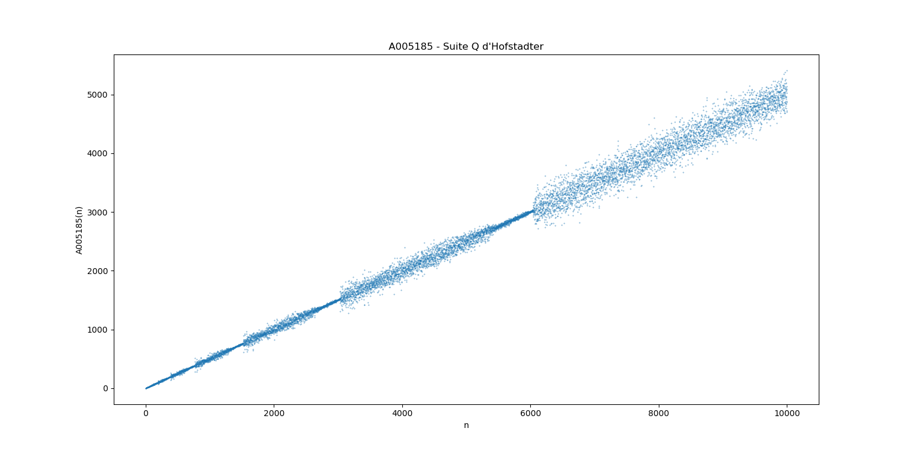
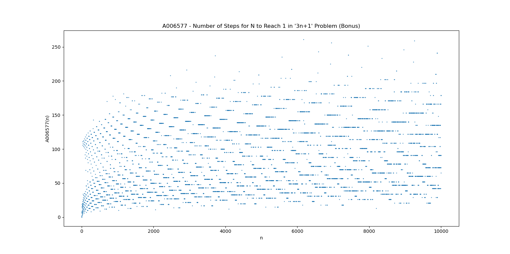
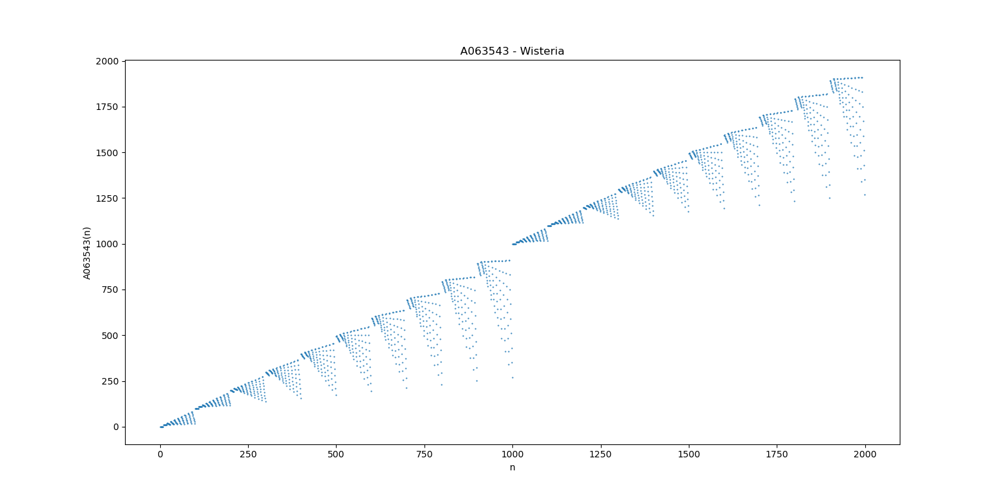
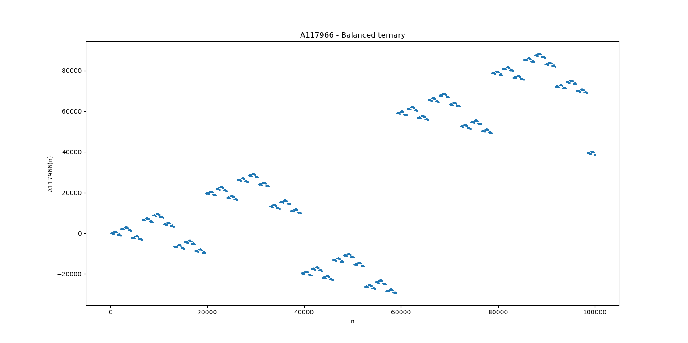
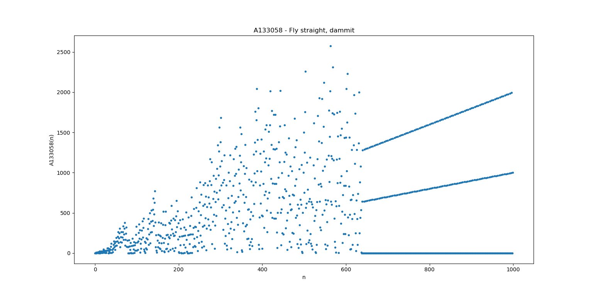
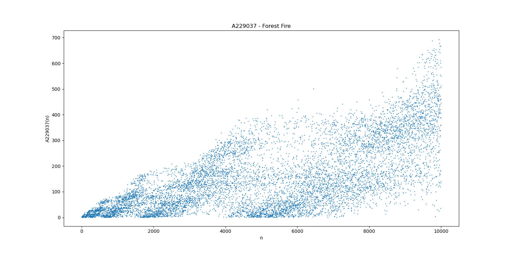
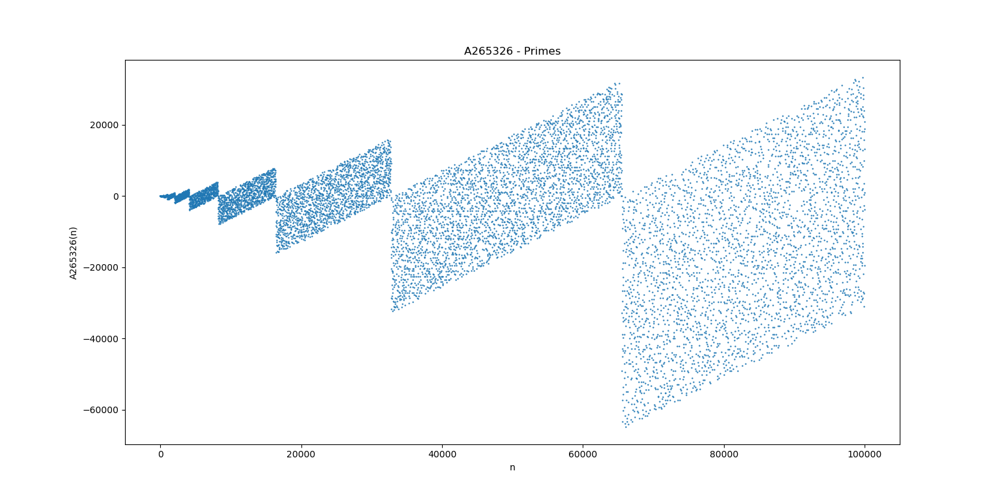
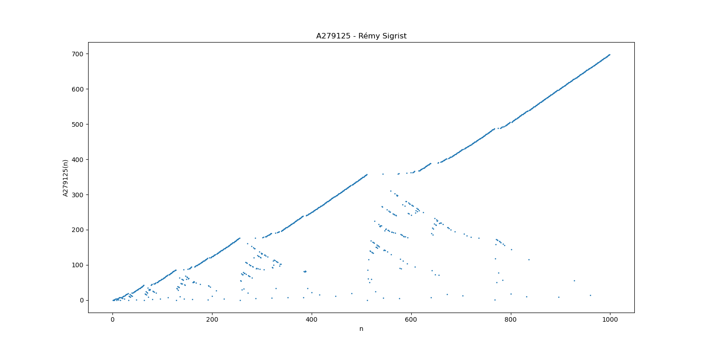

[](https://github.com/armandwayoff/Amazing-Graphs/blob/master/LICENSE)


Programming and plotting graphs from the Numberphile *Amazing Graphs* series

## Table of Contents

* [About the Project](#about-the-project)
* [How to Use This Code](#how-to-use-this-code)
  * [Installing Matplotlib](#installing-matplotlib)
* [Presentation of the Sequences](#presentation-of-the-sequences)
  * [A002487 - Stern's Sequence](#a002487---sterns-sequence)
  * [A005185 - Hofstadter's Q Sequence](#a005185---hofstadters-q-sequence)
  * [A006577 - Number of Steps for N to Reach 1 in '3n+1' Problem (Bonus)](#a006577---number-of-steps-for-n-to-reach-1-in-3n1-problem-bonus)
  * [A063543 - Wisteria](#a063543---wisteria)
  * [A117966 - Balanced Ternary](#a117966---balanced-ternary)
  * [A133058 - Fly Staight Dammit !](#a133058---fly-staight-dammit-)
  * [A229037 - Forest Fire](#a229037---forest-fire)
  * [A265326 - Primes](#a265326---primes)
  * [A279125 - Rémy Sigrist](#a279125---rémy-sigrist)
* [License](#license)

## About the Project

On August 2019, the [Numberphile](https://www.youtube.com/user/numberphile/) YouTube channel posted a series of three videos in which the mathematician Neil J. A. Sloane presents amazing graphs generated by particular mathematical sequences.
I wanted to reproduce these graphs myself and I present the result in this article.

Amazing Graphs trilogy :
  
  1. [Amazing Graphs - Numberphile](https://youtu.be/pAMgUB51XZA)
  2. [Amazing Graphs II (including Star Wars) - Numberphile](https://youtu.be/o8c4uYnnNnc)
  3. [Amazing Graphs III - Numberphile](https://youtu.be/j0o-pMIR8uk)

Neil J. A. Sloane is known for having founded the OEIS, a book and then a website on which hundreds of thousands of mathematical sequences are referenced. I strongly encourage you to visit the [OEIS website](https://oeis.org/).

## How to Use This Code

To run this code, you will need the [Matplotlib](https://matplotlib.org/) library. Matplotlib is a complete library for creating static, animated and interactive visualizations in Python.

### Installing Matplotlib

You will find all the information necessary for its installation on the following page : <https://matplotlib.org/users/installing.html>

## Presentation of the Sequences

* ### A002487 - Stern's Sequence

  #### Scatterplot of A002487(n)
  
  
  
  #### Links
  
  OEIS page : <https://oeis.org/A002487>.  
  Amazing Graphs III - Numberphile : <https://youtu.be/j0o-pMIR8uk>.
  
* ### A005185 - Hofstadter's Q Sequence
  
  #### Scatterplot of A005185(n)
  
  
  
  #### Links

  OEIS page : <https://oeis.org/A005185>.  
  Amazing Graphs III - Numberphile : <https://youtu.be/j0o-pMIR8uk?t=116>.
  
* ### A006577 - Number of Steps for N to Reach 1 in '3n+1' Problem (Bonus)
  
  ❕ This graph is not presented in Numberphile's trilogy but I still want to share it with you

  #### Scatterplot of A006577(n)
  
  
  
  #### Links

  OEIS page : <https://oeis.org/A006577>.  
  UNCRACKABLE? The Collatz Conjecture - Numberphile : <https://youtu.be/5mFpVDpKX70>.
  
* ### A063543 - Wisteria
  
  #### Scatterplot of A063543(n)
  
  
  
  #### Links

  OEIS page : <https://oeis.org/A063543>.  
  Amazing Graphs II (including Star Wars) - Numberphile : <https://youtu.be/o8c4uYnnNnc?t=110>.
  
* ### A117966 - Balanced Ternary
  
  #### Scatterplot of A117966(n)
  
  
  
  #### Links

  OEIS page : <https://oeis.org/A117966>.  
  Amazing Graphs II (including Star Wars) - Numberphile : <https://youtu.be/o8c4uYnnNnc?>.  

* ### A133058 - Fly Staight Dammit !
  
  #### Scatterplot of A133058(n)
  
  
  
  #### Links

  OEIS page : <https://oeis.org/A133058>.  
  Amazing Graphs - Numberphile : <https://youtu.be/pAMgUB51XZA?t=96>.
  
* ### A229037 - Forest Fire

  #### Scatterplot of A229037(n)
  
  
  
  #### Links

  OEIS page : <https://oeis.org/A229037>.  
  Amazing Graphs II (including Star Wars) - Numberphile : <https://youtu.be/o8c4uYnnNnc?t=217>.
  
* ### A265326 - Primes
  
  #### Scatterplot of A265326(n)
  
  
  
  #### Links

  OEIS page : <https://oeis.org/A265326>.  
  Amazing Graphs - Numberphile : <https://youtu.be/pAMgUB51XZA?t=469>.

* ### A279125 - Rémy Sigrist
  
  #### Scatterplot of A279125(n)
  
  
  
  #### Links

  OEIS page : <https://oeis.org/A279125>.  
  Amazing Graphs III - Numberphile : <https://youtu.be/j0o-pMIR8uk?t=369>.
  
## License

Distributed under the MIT License. See [```LICENSE```](https://github.com/armandwayoff/Amazing-Graphs/blob/master/LICENSE) for more information.
